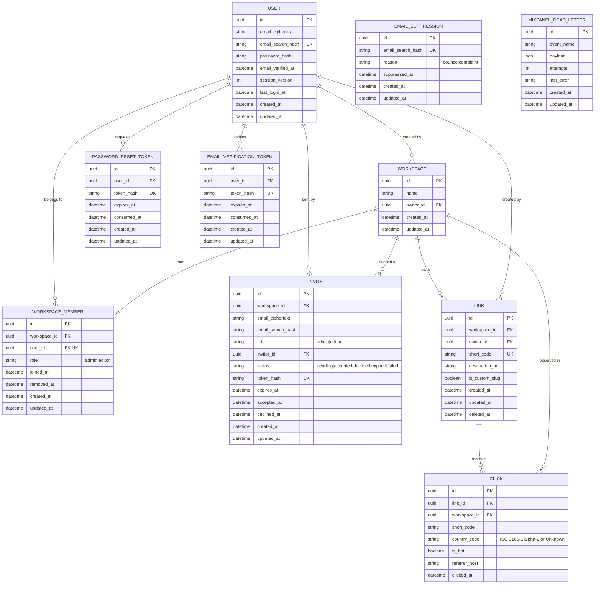

# Snip — Entity Relationship Diagram

**Status:** Draft v3
**Derived from:** PRD v3 (2026-05-25)

This ERD captures the v1 data model. It is the contract for ORM model definitions and the source of truth for `be-erd-compliance` reviews of the eventual code.

## Entities

## Notes

### Soft delete
- `LINK.deleted_at` — 30-day soft-delete window per PRD §"Data retention", then hard-delete via scheduled job.
- `WORKSPACE_MEMBER.removed_at` — Admins can see who used to belong without keeping a separate history table.

### Multi-tenant scoping
Every workspace-scoped row carries `workspace_id` **directly** (no `owner_id → user_id → workspace_id` paths). This applies to `LINK`, `INVITE`, `WORKSPACE_MEMBER`, and **now `CLICK`** — the redirect service has the LINK row in hand at click-emission time and writes `workspace_id` alongside `link_id`. Index `CLICK` on `(workspace_id, clicked_at)` for workspace-scoped time-range queries.

### Email encryption at rest
Per PRD NFR §Security ("Email addresses encrypted at rest"), email columns are split into two parts wherever an email appears:

| Column | Purpose | Storage |
|---|---|---|
| `email_ciphertext` | The canonical email, encrypted with AES-256-GCM using a DEK from KMS | application-layer encryption, plaintext never persisted |
| `email_search_hash` | A keyed HMAC-SHA256 over the lowercased email, used as the lookup / uniqueness key | persisted in plaintext; cannot reverse to email |

`USER.email_search_hash` is unique (replaces the v1 `USER.email UK`). `INVITE.email_search_hash` and `EMAIL_SUPPRESSION.email_search_hash` carry the same pattern but only EMAIL_SUPPRESSION declares it unique (one suppression row per address). Login, password reset, invite reuse, and suppression lookup all hash-then-query.

### Uniqueness constraints not natively expressible in Mermaid

Mermaid `erDiagram` cannot express partial-unique or conditional-unique indexes. The constraints below must be declared in migrations:

| Entity | Constraint | Rationale (PRD ref) |
|---|---|---|
| `WORKSPACE_MEMBER` | Partial UK on `user_id WHERE removed_at IS NULL` | "Every Member belongs to exactly one Workspace in v1" — §Teams line 139. The `user_id UK` marker on the column above hints at this, but the actual index is partial so removed rows don't block re-membership in future. |
| `INVITE` | Partial UK on `(workspace_id, email_search_hash) WHERE status = 'pending'` | "Re-inviting a still-pending email replaces the existing invite" — §Teams line 142. |
| `LINK` | Partial UK on `short_code WHERE deleted_at IS NULL` (plus a 30-day reuse window enforced in app code) | "A previously deleted slug becomes reusable after 30 days" — §Link creation line 81. |

### Click table
`short_code` is denormalized on CLICK so the redirect-emission write path doesn't need to dereference LINK. `link_id` remains the FK for joins. Both `workspace_id` and `link_id` are indexed.

### Token tables
Both `PASSWORD_RESET_TOKEN` and `EMAIL_VERIFICATION_TOKEN` store **hashes** of the raw token, never the raw token itself. The raw token is emailed once and is unrecoverable from the database. `consumed_at` enforces single-use semantics at the DB layer. `updated_at` is included because setting `consumed_at` is a row mutation; ORM frameworks also benefit from a consistent audit-column contract across all tables.

### Mixpanel dead letter
Stores failed event payloads for replay or audit per PRD §External integrations / Mixpanel. `updated_at` is now declared since `attempts` and `last_error` mutate during retry cycles.

### Enums

These columns carry closed value sets (see PRD references). Allowed values are also annotated inline on each column in the diagram above. Mermaid `string` is a notation limitation — implement as DB enums or CHECK constraints in migrations.

| Column | Allowed values | PRD reference |
|---|---|---|
| `WORKSPACE_MEMBER.role` | `admin`, `editor` | §Teams line 141 |
| `INVITE.role` | `admin`, `editor` | §Teams line 141 |
| `INVITE.status` | `pending`, `accepted`, `declined`, `expired`, `failed` | §Teams lines 142-155, §Email-delivery line 222 |
| `EMAIL_SUPPRESSION.reason` | `bounce`, `complaint` | §Email-delivery line 219 |
| `CLICK.country_code` | ISO 3166-1 alpha-2 or `Unknown` | §Click analytics line 125, §GeoLite2 line 233 |

## Out of ERD scope

- Click retention enforcement (13-month rolling delete) — a scheduled job, not a column.
- Audit logs of admin actions — explicitly out of scope for v1 per PRD §Out of scope.
- Workspace deletion lifecycle — PRD has no `Workspace.deleted_at` requirement in v1; this is a known PRD Gate 3 gap.
