# Snip — Entity Relationship Diagram

**Status:** Draft v5
**Derived from:** PRD v5 (2026-06-04)

This ERD captures the v1 data model. It is the contract for ORM model definitions and the source of truth for `be-erd-compliance` reviews of the eventual code.

## Entities

```mermaid
erDiagram
    USER ||--o{ WORKSPACE : "created by"
    USER ||--o{ WORKSPACE_MEMBER : "belongs to"
    WORKSPACE ||--|{ WORKSPACE_MEMBER : "has"
    USER o|--o{ INVITE : "sent by"
    WORKSPACE ||--o{ INVITE : "scoped to"
    WORKSPACE ||--o{ LINK : "owns"
    USER ||--o{ LINK : "owned by"
    LINK ||--o{ CLICK : "receives"
    WORKSPACE ||--o{ CLICK : "observed in"
    USER ||--o{ PASSWORD_RESET_TOKEN : "requests"
    USER ||--o{ EMAIL_VERIFICATION_TOKEN : "verifies"
    LINK ||--o{ ABUSE_REVIEW : "flagged as"
    USER o|--o{ ABUSE_REVIEW : "reviewed by"
    WORKSPACE ||--o{ ABUSE_REVIEW : "scoped to"
    USER ||--o{ SESSION : "has"
    USER ||--o{ LOGIN_ATTEMPT : "throttled by"

    USER {
        uuid id PK
        string email_ciphertext
        string email_search_hash UK
        string password_hash
        datetime email_verified_at
        int session_version
        datetime last_login_at
        datetime created_at
        datetime updated_at
    }

    SESSION {
        string id PK "HMAC-signed opaque id stored in cookie"
        uuid user_id FK
        int session_version "snapshot at issue time; auth middleware rejects if != USER.session_version"
        datetime expires_at "absolute 30-day expiry"
        datetime last_activity_at "reset on every authenticated request; idle expiry fires at now - last_activity_at > 7 days"
        datetime created_at
    }

    LOGIN_ATTEMPT {
        string id PK "keyed on email_search_hash"
        string email_search_hash
        int attempt_count "resets when window_start is > 15 min ago"
        datetime window_start "start of the current 15-minute counting window"
        datetime locked_until "null when not locked; set to now+15min when attempt_count reaches 5"
    }

    WORKSPACE {
        uuid id PK
        string name
        uuid owner_id FK
        datetime created_at
        datetime updated_at
    }

    WORKSPACE_MEMBER {
        uuid id PK
        uuid workspace_id FK
        uuid user_id FK
        string role "admin|editor"
        datetime joined_at
        datetime removed_at
        datetime created_at
        datetime updated_at
    }

    INVITE {
        uuid id PK
        uuid workspace_id FK
        string email_ciphertext
        string email_search_hash
        string role "admin|editor"
        uuid inviter_id FK
        string status "pending|accepted|declined|expired|cancelled|failed"
        string token_hash UK
        datetime expires_at
        datetime accepted_at
        datetime declined_at
        datetime created_at
        datetime updated_at
    }

    LINK {
        uuid id PK
        uuid workspace_id FK
        uuid owner_id FK "mutable; reassigned to removing Admin on member removal"
        uuid created_by_id FK "immutable; original creator; preserved after owner reassignment"
        string short_code "partial UK: WHERE deleted_at IS NULL — declared in migration, not globally unique"
        string destination_url "max 2048 characters"
        boolean is_custom_slug
        datetime created_at
        datetime updated_at
        datetime deleted_at
        datetime disabled_at
    }

    CLICK {
        uuid id PK
        uuid link_id FK
        uuid workspace_id FK
        uuid event_id UK "stable idempotency key emitted by the redirect service per click"
        string short_code
        string country_code "ISO 3166-1 alpha-2 or Unknown"
        string user_agent "raw UA string from redirect service; evaluated by ingest consumer"
        boolean is_bot "set by ingest consumer after evaluating user_agent"
        string referrer_host
        datetime clicked_at
        datetime created_at
    }

    PASSWORD_RESET_TOKEN {
        uuid id PK
        uuid user_id FK
        string token_hash UK
        datetime expires_at
        datetime consumed_at
        datetime created_at
        datetime updated_at
    }

    EMAIL_VERIFICATION_TOKEN {
        uuid id PK
        uuid user_id FK
        string token_hash UK
        datetime expires_at
        datetime consumed_at
        datetime created_at
        datetime updated_at
    }

    EMAIL_SUPPRESSION {
        uuid id PK
        string email_ciphertext "AES-256-GCM encrypted; for ops/audit use"
        string email_search_hash UK
        string reason "bounce|complaint"
        datetime suppressed_at
        datetime created_at
        datetime updated_at
    }

    MIXPANEL_DEAD_LETTER {
        uuid id PK
        uuid workspace_id "nullable — null for account-level events (e.g. password_reset_requested)"
        string event_name
        json payload
        int attempts
        string last_error
        datetime created_at
        datetime updated_at
    }

    ABUSE_REVIEW {
        uuid id PK
        uuid link_id FK
        uuid workspace_id FK
        uuid reviewer_id FK "nullable until a reviewer acts"
        string status "pending_review|whitelisted|disabled|hard_deleted"
        datetime flagged_at
        datetime reviewed_at
        datetime created_at
        datetime updated_at
    }
```

## Notes

### Session and login-attempt state (Redis-backed)

`SESSION` and `LOGIN_ATTEMPT` are logical entities documented in this ERD but implemented as Redis hash structures, **not** Postgres tables. No ORM model or migration is generated for them.

- **SESSION**: keyed by session id (Redis key `session:<id>`). Stores `user_id`, `session_version` (compared against `USER.session_version` on every auth check — mismatch → 401), `expires_at` (absolute 30-day), `last_activity_at` (refreshed on each request; idle expiry = 7 days since last activity). `USER.session_version` is incremented on password change, password reset, and admin member-removal to invalidate all sessions globally.
- **LOGIN_ATTEMPT**: keyed by `email_search_hash` (Redis key `login_attempts:<hash>`). Stores `attempt_count`, `window_start` (15-minute window), `locked_until`. Redis TTL is set to the end of the lockout window. When `attempt_count` reaches 5, `locked_until = now + 15 min` and any auth attempt for that email returns 429 until the window expires.

### LINK — dual creator/owner columns

`LINK.owner_id` is **mutable**: it is reassigned to the performing Admin when a Member is removed (PRD §Teams — "atomically reassigns owner_id"). `LINK.created_by_id` is **immutable**: it records the original creator and is never changed. The link list displays `created_by_id` for attribution; `owner_id` is used for permission checks and current-ownership semantics. Both are non-nullable FKs to USER; USER records are never hard-deleted in v1.

### Soft delete
- `LINK.deleted_at` — 30-day soft-delete window per PRD §"Data retention", then hard-delete via scheduled job.
- `LINK.disabled_at` — Ops-initiated disable set by trust-and-safety reviewers via the abuse review flow (PRD §Link creation). Semantically distinct from `deleted_at`: disable is reversible (a "whitelist" action clears `disabled_at`), does not start the 30-day slug-reuse clock, and is invisible to the link owner. The redirect service checks `deleted_at IS NOT NULL OR disabled_at IS NOT NULL` to return 404; only `deleted_at IS NOT NULL` triggers reuse-window logic.
- `WORKSPACE_MEMBER.removed_at` — Admins can see who used to belong without keeping a separate history table.

### Multi-tenant scoping
Every workspace-scoped row carries `workspace_id` **directly** (no `owner_id → user_id → workspace_id` paths). This applies to `LINK`, `INVITE`, `WORKSPACE_MEMBER`, `CLICK`, and `ABUSE_REVIEW`. The redirect service has the LINK row in hand at click-emission time and writes `workspace_id` alongside `link_id`. `ABUSE_REVIEW.workspace_id` enables workspace-scoped ops queries without a join to LINK. `MIXPANEL_DEAD_LETTER.workspace_id` is nullable — account-level events (e.g. `password_reset_requested`) have no workspace context. Index `CLICK` on `(workspace_id, clicked_at)` for workspace-scoped time-range queries.

### Email encryption at rest
Per PRD NFR §Security ("Email addresses encrypted at rest"), email columns are split into two parts wherever an email appears:

| Column | Purpose | Storage |
|---|---|---|
| `email_ciphertext` | The canonical email, encrypted with AES-256-GCM using a per-row DEK sealed by AWS KMS | application-layer encryption, plaintext never persisted |
| `email_search_hash` | A keyed HMAC-SHA256 over the lowercased email, used as the lookup / uniqueness key | persisted in plaintext; cannot reverse to email |

`USER.email_search_hash` is unique (replaces the v1 `USER.email UK`). `INVITE.email_search_hash` and `EMAIL_SUPPRESSION.email_search_hash` carry the same pattern but only EMAIL_SUPPRESSION declares it unique (one suppression row per address). Login, password reset, invite reuse, and suppression lookup all hash-then-query.

`EMAIL_SUPPRESSION` now includes `email_ciphertext` (in addition to `email_search_hash`) for ops/audit use — without it, operators cannot identify which address a suppression record refers to. The suppression record has no FK to USER because not every suppressed address maps to a Snip user account (e.g., a bounce from an invite recipient who never signed up).

### Uniqueness constraints not natively expressible in Mermaid

Mermaid `erDiagram` cannot express partial-unique or conditional-unique indexes. The constraints below must be declared in migrations. The inline `UK` markers on columns in this diagram are reserved for **global** unique indexes only; partial uniques are documented here:

| Entity | Constraint | Rationale (PRD ref) |
|---|---|---|
| `WORKSPACE_MEMBER` | Partial UK on `user_id WHERE removed_at IS NULL` | "Every Member belongs to exactly one Workspace in v1" — §Teams. The `user_id` column carries **no inline UK marker** in the diagram to avoid implying a global constraint. The actual index is partial so removed rows do not block re-membership. |
| `INVITE` | Partial UK on `(workspace_id, email_search_hash) WHERE status = 'pending'` | "Re-inviting a still-pending email replaces the existing invite" — §Teams. |
| `LINK` | Partial UK on `short_code WHERE deleted_at IS NULL` (plus a 30-day reuse window enforced in app code) | "A previously deleted slug becomes reusable after 30 days" — §Link creation. The `short_code` column carries **no inline UK marker** in the diagram. |
| `CLICK` | Global unique index on `event_id` | Idempotency for the at-least-once SQS ingest consumer. `event_id` is a stable UUID generated by the redirect service per click and included in the SQS message payload. Using a single-column UUID key is superior to the `(link_id, clicked_at)` composite originally specified because: (a) two distinct clicks on a high-traffic link within the same microsecond would both satisfy a timestamp-keyed unique and be discarded; (b) the redirect service already generates a UUID per request, making it the authoritative deduplication token. Duplicate SQS deliveries are silently discarded on `ON CONFLICT DO NOTHING` against `uq_click_event_id`. |

### Click table
`short_code` is denormalized on CLICK so the redirect-emission write path doesn't need to dereference LINK. `link_id` remains the FK for joins. Both `workspace_id` and `link_id` are indexed. `created_at` records the row-insert time (which may lag `clicked_at` by up to 60 seconds under pipeline buffering). CLICK is append-only — no field mutates after insert; `updated_at` is intentionally omitted. `user_agent` is the raw User-Agent string forwarded from the redirect service; the ingest consumer evaluates it against the IAB/ABC Spiders & Bots List and sets `is_bot` before persisting. `event_id` is a UUID generated by the redirect service per click and carried in the SQS message; the ingest consumer uses it as the sole idempotency key (global unique `uq_click_event_id`). At high traffic volumes, consider range-partitioning CLICK on `clicked_at` (monthly partitions) and using partition pruning on time-range queries; the 13-month rolling-delete scheduled job drops whole partitions rather than single rows.

### Abuse review
`ABUSE_REVIEW` represents the queue of links flagged by the Google Safe Browsing check and awaiting trust-and-safety action (PRD §Link creation). `flagged_at` is set when the flag is created; `reviewed_at` is set when a reviewer takes action. `reviewer_id` is nullable until a reviewer acts — reflected by the `USER o|--o{ ABUSE_REVIEW` cardinality (zero-or-one USER on the reviewer side). `workspace_id` is carried directly for workspace-scoped ops queries. A link may accumulate multiple review records if flagged, whitelisted, then flagged again. The current operative review state is the most-recent row by `flagged_at`. `LINK.disabled_at` carries the live disable signal for the redirect service so it does not need to join `ABUSE_REVIEW` on the hot path.

### Token tables
Both `PASSWORD_RESET_TOKEN` and `EMAIL_VERIFICATION_TOKEN` store **hashes** of the raw token, never the raw token itself. The raw token is emailed once and is unrecoverable from the database. `consumed_at` enforces single-use semantics at the DB layer. `updated_at` is included because setting `consumed_at` is a row mutation; ORM frameworks also benefit from a consistent audit-column contract across all tables.

### Mixpanel dead letter
Stores failed event payloads for replay or audit per PRD §External integrations / Mixpanel. `updated_at` is now declared since `attempts` and `last_error` mutate during retry cycles. `workspace_id` is nullable: workspace-scoped events (`link_created`, `link_clicked`, `member_invited`) carry a workspace_id; account-level events (`password_reset_requested`) do not.

### Enums

These columns carry closed value sets (see PRD references). Allowed values are also annotated inline on each column in the diagram above. Mermaid `string` is a notation limitation — implement as DB enums or CHECK constraints in migrations.

| Column | Allowed values | PRD reference |
|---|---|---|
| `WORKSPACE_MEMBER.role` | `admin`, `editor` | §Teams line 141 |
| `INVITE.role` | `admin`, `editor` | §Teams line 141 |
| `INVITE.status` | `pending`, `accepted`, `declined`, `expired`, `cancelled`, `failed` | §Teams; `cancelled` is set when the inviter is removed from the Workspace (all their pending invites are cancelled atomically — PRD §Teams member removal) |
| `EMAIL_SUPPRESSION.reason` | `bounce`, `complaint` | §Email-delivery line 219 |
| `CLICK.country_code` | ISO 3166-1 alpha-2 or `Unknown` | §Click analytics line 125, §GeoLite2 line 233 |
| `ABUSE_REVIEW.status` | `pending_review`, `whitelisted`, `disabled`, `hard_deleted` | §Link creation (abuse review flow) |

### Reserved slug enforcement

The 12 reserved words (`admin`, `api`, `app`, `auth`, `dashboard`, `help`, `login`, `logout`, `settings`, `signup`, `static`, `www`) are enforced at the application layer (exact-match, case-insensitive) before the short_code is written. No DB table is needed — the list is a static constant in the link-creation service. A CHECK constraint is not used because the list may expand; application-layer validation is the single enforcement point.

### INVITE.inviter_id cardinality

The `USER o|--o{ INVITE` line makes the USER side optional (zero-or-one per invite), reflecting that `inviter_id` may become logically detached if the inviter account is deleted in a future version. In v1, USER records are never hard-deleted, so `inviter_id` is always a valid FK — but making it nullable now avoids a future migration. The column is nullable at the DB layer.

## Out of ERD scope

- Click retention enforcement (13-month rolling delete) — a scheduled job, not a column.
- Audit logs of admin actions — explicitly out of scope for v1 per PRD §Out of scope.
- Workspace deletion lifecycle — PRD has no `Workspace.deleted_at` requirement in v1; this is a known PRD gap deferred to post-v1.
